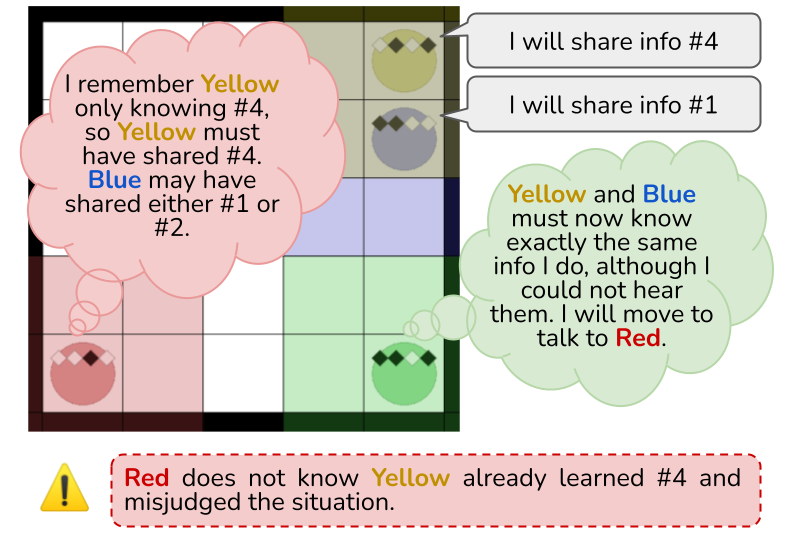

# Code for Symmetric Machine Theory of Mind

## SymmToM, the environment


Simplified example of the kind of the deductions needed to succeed in SymmToM.

Please refer to the [manuscript](https://proceedings.mlr.press/v162/sclar22a.html) for a detailed description and motivation of the environment.

### Code-specific information

SymmToM is a modification of OpenAI's [Multi-Agent Particle Environment (MPE)](https://github.com/openai/multiagent-particle-envs), adapted to allow creating gridworlds.
See class `RealGridWorld` for implementation of a gridworld under the MPE framework.

SymmToM's implementation can be found in `multiagent-particle-envs/multiagent/scenarios/simple_symmtom.py`. 
You can install (in editable mode) our modification of the MPE library by running:

```
cd multiagent-particle-envs
pip install -e .
```

Once installed, you can use similarly as with any other MPE environment (see original MADDPG code as an example, or ours below).

### Training tailored modifications of MADDPG for SymmToM [code soon to be available]

**If you just want to use SymmToM, ignore this section. This will only be useful if you want to train and evaluate your own model.**
All models trained are stored [here](https://drive.google.com/file/d/1iIq9nLDpTEM9GxC6zGgvh7Zm9-z1pyXm/view), and the metrics for each particular run can be found [here](https://drive.google.com/file/d/1KOFW3i9y5wFscmhb_uS_qn0bSzAE1pdc/view).

As discussed in the [manuscript](https://proceedings.mlr.press/v162/sclar22a.html), we tailored MADDPG to the specific task with the goal of showing its difficulty.

We directly modified the original [MADDPG](https://github.com/openai/maddpg) code since other Pytorch versions available on the web achieved lower average rewards, based on preliminary experiments. 
This requires installing older versions of some packages, but it is important to note that this is _only required if you want to train your own modified MADDPG model_. Most users will not need this section.

See example command is as follows.

``` 
cd maddpg
python experiments/train_oracle.py --scenario simple_symmtom --save-dir tmp/ --exp-name name \ 
    --cells_width=14 --num_cells_hearing=2 --num_agents=4 --dim_c=12 --restricted_speech --num-episodes 60000 \
    --max-episode-len 60 --lr 0.001 --tau 0.005 --sample_independent_of_episode --critic-type mlp \
    --critic-has-oracle-obs-space --actor-type first_self --first_order_tom_h_heard_type precise_atomic
```

Some warnings are generated, but they do not affect performance.

#### Python requirements for training your own model. Ignore completely if you just want to use the environment.

We used python 3.6.8, and below can be found the exhaustive list of `pip show list` of the pip environment we used (not all may be needed).

```
absl-py (1.0.0)
astor (0.8.1)
azure (1.0.3)
azure-common (1.1.27)
azure-mgmt (0.20.2)
azure-mgmt-common (0.20.0)
azure-mgmt-compute (0.20.1)
azure-mgmt-network (0.20.1)
azure-mgmt-nspkg (3.0.2)
azure-mgmt-resource (0.20.1)
azure-mgmt-storage (0.20.0)
azure-nspkg (3.0.2)
azure-servicebus (0.20.1)
azure-servicemanagement-legacy (0.20.2)
azure-storage (0.20.3)
baselines (0.1.3)
cached-property (1.5.2)
certifi (2021.10.8)
charset-normalizer (2.0.7)
click (8.0.3)
cloudpickle (2.0.0)
configparser (5.1.0)
cycler (0.11.0)
dataclasses (0.8)
dill (0.3.4)
docker-pycreds (0.4.0)
gast (0.5.3)
gitdb (4.0.9)
GitPython (3.1.20)
google-pasta (0.2.0)
grpcio (1.41.1)
gym (0.21.0)
h5py (3.1.0)
idna (3.3)
importlib-metadata (4.8.2)
javapackages (4.3.2)
joblib (1.1.0)
Keras-Applications (1.0.8)
Keras-Preprocessing (1.1.2)
kiwisolver (1.3.1)
maddpg (0.0.1, /homes/gws/msclar/rmaddpg/maddpg)
Markdown (3.3.6)
matplotlib (3.3.4)
multiagent (0.0.1, /homes/gws/msclar/rmaddpg/multiagent-particle-envs)
numpy (1.19.5)
numpy-stl (2.16.3)
pandas (1.1.5)
pathtools (0.1.2)
Pillow (8.4.0)
pip (9.0.3)
progressbar2 (3.55.0)
promise (2.3)
protobuf (3.19.1)
psutil (5.8.0)
pyparsing (3.0.6)
python-dateutil (2.8.2)
python-utils (2.5.6)
pytz (2021.3)
PyXB (1.2.4)
PyYAML (6.0)
pyzmq (22.3.0)
requests (2.26.0)
scipy (1.5.4)
seaborn (0.11.2)
sentry-sdk (1.5.0)
setuptools (59.1.1)
shortuuid (1.0.8)
six (1.16.0)
smmap (5.0.0)
subprocess32 (3.5.4)
tensorboard (1.14.0)
tensorflow (1.14.0)
tensorflow-estimator (1.14.0)
termcolor (1.1.0)
tqdm (4.62.3)
typing-extensions (4.0.0)
urllib3 (1.26.7)
wandb (0.12.6)
Werkzeug (2.0.2)
wheel (0.37.0)
wrapt (1.13.3)
yaspin (2.1.0)
zipp (3.6.0)
zmq (0.0.0)
```

Do not forget to install our version of multiagent-particle-envs (see above section).

## Paper Citation

If you used this code for your experiments or found it helpful, consider citing the following paper:

```
@InProceedings{pmlr-v162-sclar22a,
  title = 	 {Symmetric Machine Theory of Mind},
  author =       {Sclar, Melanie and Neubig, Graham and Bisk, Yonatan},
  booktitle = 	 {Proceedings of the 39th International Conference on Machine Learning},
  pages = 	 {19450--19466},
  year = 	 {2022},
  editor = 	 {Chaudhuri, Kamalika and Jegelka, Stefanie and Song, Le and Szepesvari, Csaba and Niu, Gang and Sabato, Sivan},
  volume = 	 {162},
  series = 	 {Proceedings of Machine Learning Research},
  month = 	 {17--23 Jul},
  publisher =    {PMLR},
  pdf = 	 {https://proceedings.mlr.press/v162/sclar22a/sclar22a.pdf},
  url = 	 {https://proceedings.mlr.press/v162/sclar22a.html},
  abstract = 	 {Theory of mind, the ability to model others’ thoughts and desires, is a cornerstone of human social intelligence. This makes it an important challenge for the machine learning community, but previous works mainly attempt to design agents that model the "mental state" of others as passive observers or in specific predefined roles, such as in speaker-listener scenarios. In contrast, we propose to model machine theory of mind in a more general symmetric scenario. We introduce a multi-agent environment SymmToM where, like in real life, all agents can speak, listen, see other agents, and move freely through the world. Effective strategies to maximize an agent’s reward require it to develop a theory of mind. We show that reinforcement learning agents that model the mental states of others achieve significant performance improvements over agents with no such theory of mind model. Importantly, our best agents still fail to achieve performance comparable to agents with access to the gold-standard mental state of other agents, demonstrating that the modeling of theory of mind in multi-agent scenarios is very much an open challenge.}
}
```